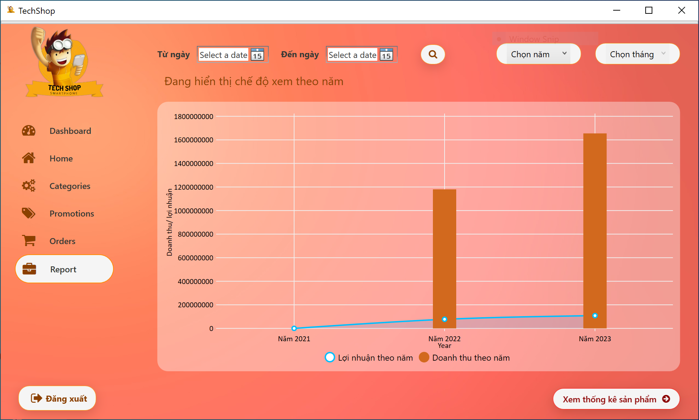

# MyShop Desktop Application

- Made with C# language
- Made with WPF Framework for User Interface
- Made with SQL Database
- The Project of **Windows Programming** Subject (Trần Duy Quang, M.Sc Instructor)
- Scores: 10/10
- Members of the Group:

    1. Nguyễn Thái Hiệp
    2. Nguyễn Thị Ngọc Hải
    3. Đỗ Đức Duy
    4. Nguyễn Hồng Tấn

# Requirements

- Install [Visual Studio](https://visualstudio.microsoft.com/downloads/)
- Install [SQL Server](https://www.microsoft.com/en-us/sql-server/sql-server-downloads)

# Development

```
- Run `MyShopDB_10.sql` file in Assets/scriptDBs/. folder
- Install the project throught `setup1.exe` file
```

# Deployment

```
- Run MyShop.exe
```

### Note: 
- This project runs on Microsoft .NET 7 framework
- Please remember that entering your SQL Server login information correctly

# Database


# Overview

- Video Demo: https://www.youtube.com/watch?v=UzZvBsYFgZI&t=45s

- DashBoardPage
    
- HomePage
    
- DetailPage
    
- OrdersPage
    
- AddPordersPage
    
- ReportPage
    
- CategoriesPage
    
- AddProductPage
    
- ReportProcuctPage
    

Authors: Nguyễn Thái Hiệp, Nguyễn Thị Ngọc Hải, Đỗ Đức Duy, Nguyễn Hồng Tấn


Thanks for watching.
